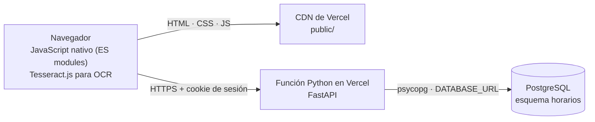

# Horarios

Aplicación web para consultar, en un solo lugar, **quién está ocupado y cuándo** dentro de una
agrupación estudiantil. Cada miembro aporta su horario de clases (PDF, imagen o captura) y,
opcionalmente, su horario laboral; la aplicación los consolida y responde a la pregunta que
realmente importa al coordinar reuniones: **¿cuándo estamos todos libres?**

Diseñada para varias agrupaciones en una misma instalación, con datos aislados entre sí.

## Contenido

- [Características](#características)
- [Roles y permisos](#roles-y-permisos)
- [Arquitectura](#arquitectura)
- [Estructura del repositorio](#estructura-del-repositorio)
- [Puesta en marcha local](#puesta-en-marcha-local)
- [Despliegue](#despliegue)
- [Operación](#operación)
- [Modelo de datos](#modelo-de-datos)
- [API](#api)
- [Seguridad](#seguridad)
- [Pruebas](#pruebas)
- [Limitaciones conocidas](#limitaciones-conocidas)

## Características

**Consulta**

- **Vista semanal** de lunes a viernes, con la disposición de la tabla de horario impreso. Cada
  bloque indica cuántas personas están ocupadas y quiénes; el espacio en blanco es tiempo libre.
  La rejilla se ajusta al alto de la ventana.
- **Vista por día**, con una regla horaria que destaca los huecos libres y marca la hora actual.
- **Ficha por persona**, con su semana completa, materia, aula y marcas de laboratorio o grupo.
- **Búsqueda por nombre**, insensible a tildes y mayúsculas.
- Los bloques consecutivos de una misma persona se unen cuando la pausa es de 10 minutos o menos.

**Carga de horarios**

- **PDF**: lectura exacta de la tabla del horario, celda por celda.
- **Imagen**: reconocimiento óptico (OCR) ejecutado en el navegador. El resultado es una
  propuesta editable y **nunca se guarda sin revisión**.
- **Entrada manual**: alta, edición y borrado de cualquier bloque, sea cual sea su origen.
- **Horario laboral**: franjas de trabajo que cuentan como ocupación igual que una clase.
- **Informe de subida** por archivo, con el nombre exacto y el motivo de cada fallo; un archivo
  defectuoso no bloquea al resto.
- **Clases virtuales excluidas**: las que no ocupan físicamente a nadie no cuentan como tiempo
  ocupado (véase [Limitaciones conocidas](#limitaciones-conocidas)).

**Administración**

- Cuentas propias, agrupaciones aisladas y flujo de solicitud de acceso con aprobación.
- Gestión de miembros restringida a la cuenta principal de cada agrupación.
- Alta inicial desde la propia web, sin acceso a la base de datos.

## Roles y permisos

| Rol | Horarios | Personas y accesos |
|---|---|---|
| **Superadmin** | Todas las agrupaciones | Crea y elimina agrupaciones, aprueba solicitudes y reasigna la cuenta principal |
| **Cuenta principal** | Subir, editar y borrar | **Única** que añade, quita y da permisos a los miembros |
| **Administrador** | Subir, editar y borrar | Sin acceso a la gestión de personas |
| **Solo ver** | Consultar y buscar | — |

- La **cuenta principal** de una agrupación es la del correo inicial: el primer administrador que
  aprueba el superadmin. No puede ser eliminada ni degradada.
- Quien se añade a una agrupación entra como **solo ver**; ascenderlo a administrador es decisión
  exclusiva de la cuenta principal.
- Cualquier persona puede solicitar acceso desde la web, pero no ve nada hasta ser aprobada.
- Una cuenta puede pertenecer a varias agrupaciones.
- Para quien no es miembro, una agrupación responde `404`: no revela su existencia.

## Arquitectura



| Capa | Tecnología |
|---|---|
| Interfaz | HTML, CSS y JavaScript nativo (ES modules); sin paso de compilación |
| API | Python · FastAPI |
| Lectura de PDF | pdfplumber |
| OCR | Tesseract.js, cargado desde CDN y ejecutado en el navegador |
| Base de datos | PostgreSQL (Supabase u otro) · SQLite en desarrollo |
| Acceso a datos | psycopg 3, SQL escrito una sola vez para ambos motores |
| Alojamiento | Vercel (contenido estático + función Python) |

**Decisiones de diseño relevantes**

- **Un único SQL para dos motores.** Las consultas usan `?` y tablas `horarios.*`; en SQLite el
  archivo se adjunta con ese mismo nombre de esquema. El esquema de SQLite se deriva de
  `db/schema.sql`, que es la fuente única.
- **OCR en el cliente.** El entorno de funciones de Vercel no incluye el binario de Tesseract, y
  vendorizarlo sería pesado. Correr en el navegador evita esa dependencia y mantiene los datos
  fuera del servidor hasta que el usuario los confirma.
- **Cada archivo, una petición.** Vercel limita el tamaño de cada petición; subirlos por
  separado además aísla los fallos.

## Estructura del repositorio

```
api/index.py         Punto de entrada de la función Python
lib/
  parser.py          Lectura de la tabla del PDF y regla de clases virtuales
  schedule.py        Unión de bloques y cálculo de tramos por día
  repo.py            Todas las consultas SQL
  db.py              Conexión: Postgres si hay DATABASE_URL, SQLite si no
  security.py        Contraseñas (scrypt) y tokens de sesión
  deps.py            Dependencias de FastAPI: sesión y permisos por agrupación
  fixes.py           Correcciones de datos de una sola aplicación
  routes/            auth · setup · groups · data
public/
  index.html         Documento de entrada
  css/app.css        Estilos
  js/
    app.js           Interfaz y estado
    api.js           Cliente de la API
    dom.js           Utilidades de DOM y formato
    ocr.js           Lectura de imágenes y reparto en celdas
db/
  schema.sql         Esquema completo (fuente única)
  migrations.sql     Cambios sobre bases ya creadas
scripts/manage.py    Administración desde la terminal
tests/               Pruebas de API y del analizador del OCR
```

## Puesta en marcha local

Requisitos: Python 3.12 o superior y Node.js (solo para la prueba del OCR).

```bash
python3 -m venv .venv
.venv/bin/pip install -r requirements-dev.txt
.venv/bin/uvicorn api.index:app --port 8765     # http://localhost:8765
```

Sin `DATABASE_URL`, la aplicación usa un archivo `data.db` (SQLite) y crea las tablas sola. Con
esa variable definida se conecta a PostgreSQL.

## Despliegue

1. **Base de datos.** Cualquier PostgreSQL con conexión estándar. En Supabase, usar el
   *transaction pooler* (puerto `6543`).
2. **Vercel.** Importar el repositorio y definir la variable de entorno de la tabla siguiente.
3. **Desplegar** con `vercel --prod` o mediante la integración con GitHub.
4. **Primera cuenta.** Al abrir la web por primera vez, con la base todavía sin cuentas, aparece
   una pantalla para crear la cuenta principal. Crea las tablas si faltan y otorga el rol de
   superadmin. **Se cierra sola** en cuanto existe una cuenta.

| Variable | Obligatoria | Descripción |
|---|---|---|
| `DATABASE_URL` | Sí (producción) | Cadena de conexión de PostgreSQL |
| `HORARIOS_SQLITE` | No | Ruta del archivo SQLite en desarrollo (por defecto `data.db`) |
| `HORARIOS_PASSWORD` | No | Contraseña para `manage.py create-user`, en lugar de pedirla por teclado |

Configuración de la función (`vercel.json`): duración máxima de 30 s e inclusión de `db/**`
en el paquete, necesaria para aplicar el esquema desde la propia aplicación.

## Operación

### Migraciones y correcciones de datos

Pensado para entornos donde quien administra **no puede alcanzar el puerto de PostgreSQL** desde
su red:

- **`db/migrations.sql`** contiene cambios de esquema idempotentes. La aplicación los aplica sola,
  con un candado de base de datos, cuando detecta que falta alguno.
- **`lib/fixes.py`** contiene correcciones de datos que se ejecutan **una sola vez** y quedan
  registradas en `horarios.applied_migrations`.
- `GET /api/setup` devuelve `migrated` y `applied`, lo que permite comprobar desde fuera qué se
  aplicó y con qué resultado.

Al añadir una migración de esquema, hay que incorporar su columna a `_ESPERADAS` en `lib/db.py`.

### Administración desde la terminal

```bash
python -m scripts.manage migrate                                       # aplica db/schema.sql
python -m scripts.manage create-user correo@ejemplo.com "Nombre" --superadmin
python -m scripts.manage create-group "Nombre de la agrupación"
```

Con `--sql`, `create-user` no se conecta: calcula el hash localmente e imprime la sentencia
`INSERT` para ejecutarla en el editor SQL del proveedor.

## Modelo de datos

Todo vive en el esquema `horarios`.

| Tabla | Contenido |
|---|---|
| `users` | Cuentas: correo, nombre, hash de contraseña, marca de superadmin |
| `sessions` | Sesiones activas; guarda el hash del token, nunca el token |
| `login_failures` | Intentos fallidos, para el bloqueo temporal |
| `groups` | Agrupaciones y su cuenta principal (`owner_user_id`) |
| `memberships` | Pertenencia de cuentas a agrupaciones y rol (`admin` / `member`) |
| `requests` | Solicitudes de acceso pendientes de aprobación |
| `people` | Personas cuyo horario se gestiona, por agrupación |
| `blocks` | Bloques de horario; `kind` distingue `clase` de `trabajo` |
| `applied_migrations` | Correcciones de datos ya aplicadas |

Al eliminar una agrupación se eliminan en cascada sus personas y bloques.

## API

Todas las rutas cuelgan de `/api`. Salvo las marcadas como públicas, exigen sesión.

| Método y ruta | Rol requerido | Función |
|---|---|---|
| `POST /auth/login` · `POST /auth/logout` · `GET /auth/me` | Público / sesión | Sesión |
| `POST /auth/register` · `GET /auth/groups` | Público | Solicitar acceso |
| `POST /auth/password` | Sesión | Cambiar contraseña |
| `GET /setup` · `POST /setup` | Público | Estado de instalación y alta inicial |
| `GET /groups` · `POST /groups` | Superadmin | Listar y crear agrupaciones |
| `PUT /groups/{slug}/owner` · `DELETE /groups/{slug}` | Superadmin | Cuenta principal · eliminar |
| `GET /requests` · `POST /requests/{id}/approve` · `DELETE /requests/{id}` | Superadmin | Solicitudes |
| `GET /g/{slug}/members` · `PUT` · `DELETE …/{user_id}` | Cuenta principal | Gestión de personas |
| `GET /g/{slug}/schedule` · `/people` · `/person` | Miembro | Consulta |
| `POST /g/{slug}/upload` | Administrador | Subir PDF |
| `POST /g/{slug}/blocks` · `PUT` · `DELETE /g/{slug}/block/{id}` | Administrador | Bloques manuales |
| `DELETE /g/{slug}/person` · `DELETE /g/{slug}/people` | Administrador | Borrar horarios |

## Seguridad

- **Contraseñas**: scrypt (`n=2¹⁴`, `r=8`, `p=1`) con sal aleatoria; mínimo de 8 caracteres.
- **Sesiones**: cookie `HttpOnly`, `SameSite=Lax` y `Secure` bajo HTTPS, con caducidad de 7 días.
  En la base solo se almacena el hash SHA-256 del token.
- **Fuerza bruta**: cinco intentos fallidos bloquean el correo durante 15 minutos. Si el correo no
  existe, se realiza el mismo cálculo de hash para no revelarlo por el tiempo de respuesta.
- **Aislamiento**: cada consulta de horarios se filtra por agrupación; el acceso se comprueba en
  el servidor en cada petición.
- **Cambio de contraseña**: cierra las demás sesiones de la cuenta.
- **Base de datos**: RLS activado en todas las tablas por si el esquema llegara a exponerse.
- **Interfaz**: el contenido de archivos y nombres se inserta siempre como texto, nunca como HTML.

## Pruebas

```bash
.venv/bin/python -m pytest tests -q         # API: permisos, aislamiento, cargas, correcciones de datos
node tests/ocr.test.mjs                     # analizador del OCR
```

Las pruebas de API usan SQLite y cubren, entre otros aspectos: permisos por rol, aislamiento entre
agrupaciones, bloqueo por intentos fallidos, flujo de solicitud y aprobación, edición de bloques,
exclusión de clases virtuales y correcciones de datos.

> **Nota.** Varias pruebas cargan un horario de ejemplo llamado `HorarioClase.pdf` en la raíz del
> proyecto. El archivo no se versiona, porque `*.pdf` está excluido para no publicar horarios
> reales. Para ejecutarlas hace falta colocar allí un horario del mismo formato.

## Limitaciones conocidas

- **Formato del PDF.** El lector espera la tabla `HORAS × días` de los horarios de la UTP, con
  texto seleccionable. Un PDF escaneado se rechaza con ese motivo en lugar de adivinar.
- **OCR no exacto.** En la prueba con una captura del horario de ejemplo leyó 17 de 18 bloques.
  Por eso la revisión previa es obligatoria y los códigos de aula con formato dudoso se marcan.
- **Clases virtuales.** Se descartan las que tienen la letra **N** donde iría el primer dígito de
  un aula física: `Salón 2-N01` es virtual, `aula 3-405` no. Los números que rodean a la N no
  importan. Se aplica a PDF, imágenes y entrada manual, y también se corrigieron los datos que ya
  estaban guardados.
- **Tamaño de subida.** Cada PDF puede pesar hasta 4 MB por el límite de peticiones de Vercel.
- **Primera carga del OCR.** El lector se descarga la primera vez (unos 12 MB) y luego queda en
  caché del navegador.
